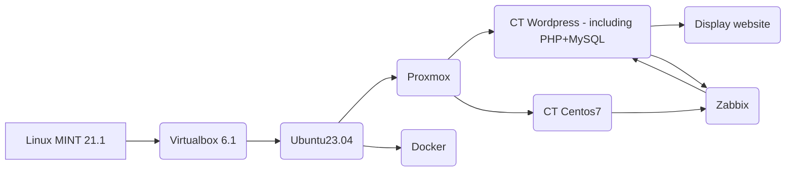

Project display website www. Workflow shows:

Configuration on ubuntu 23.04 shows:\
`inet 10.0.2.15/24 brd 10.0.2.255 scope global dynamic noprefixroute enp3s0`

To install Proxmox on ubuntu i used qemu:\
`sudo apt update`\
`sudo apt full-upgrade`\
`sudo apt install virt-manager`\
`reboot`\
`sudo virt-manager`

In qemu i created new VM with existing proxmox iso including distro name "Debian 10".
Proxmox configuration:\
`enp1s0 interface`\
`Hostname (FQDN): devops.local`\
`IPv4: 192.168.122.63 /24`\
`GW: 192.168.122.1`\
`DNS: 192.168.122.1`\
`Filesystem: ext4`

Login to proxmox:\
`login: root`\
`password: during installation`

Went to firefox and write 192.168.122.63:8006 and hit enter. Then login with root account with a password.

I installed wordpress from here: https://mirror.umd.edu/turnkeylinux/images/proxmox/ with name:\
`debian-10-turnkey-wordpress_16.1-1_amd64.tar.gz`

I Created CT LXC container with Wordpress

Useful materials you can find here:\
`https://www.youtube.com/watch?v=nW7_jnBNIRU LAMP LXC`\
`https://www.youtube.com/watch?v=OToQ4LAHz6I WORDPRESS LXC`

Wordpress configuration:\
`net0 192.168.122.122/24, gw=192.168.122.1`\
`MySQL admin password: `\
`https://192.168.122.122/wp-login`

Zabbix configuration:\
`https://github.com/takala-jp/zabbix-proxmox`\
`https://geekistheway.com/2022/12/31/monitoring-proxmox-ve-using-zabbix-agent/`\
`https://github.com/kvaps/zabbix-linux-container-template`\
`https://beitadmin.pl/tag/zabbix/`

`https://technologyrss.com/how-to-install-zabbix-server-6-2-on-ubuntu-22-04/`

need to installed "zabbix-agent2" because ubuntu 23.04 is wihout LTS.

Current issue: Zabbix server does not work. zabbix-server-mysql : need libldap-2.5-0 (>= 2.5.4) but it is not possible to install. Recommend "snmpd" but it is not installed.

Try to install CentOS 8 stream as VM in proxmox and then zabbix server on it:\
`https://computingforgeeks.com/how-to-install-zabbix-on-rhel-centos-stream/`\
Its impossible install vm on proxmox on kvm, there is an error `kvm: warning: host doesn't support requested feature: CPUID.01H:EDX.vme [bit]1`

Install CentOS as CT lxc in proxmox:\
`https://docs.ossii.com.tw/books/oxoffice-online-technical-manual/page/installation-guide-for-centos-7-in-pve-lxc-%28community-edition%29`\
Configuration:\
`ip: 192.168.122.123/24`\
`gw: 192.168.122.1`\
`username: root`\
error: "WARN: old systemd (<v232) detected, container won't run in a purge cgroupv2 enrivonment! Please see documentation -> container -> cgroup version.

In KVM proxmox edit grub file (with making backup (for example cp grub grub1):\ 
`vi /etc/default/grub and edit line to: GRUB_CMDLINE_LINUX_DEFAULT="systemd.unified_cgroup_hierarchy=0 quiet `\
then run the following command:\
`yum install vim openssh* net-tools unzip wget -y`\
`cd /etc/yum.repos.d`\
`wget --no-check-certificate http://www.oxoffice.com.tw/yum.repo/oxool-community.repo`\
`yum update -y`\
`yum groupinstall "OxOOL Community Group" -y`

Start OxOOL Community:\
`systemctl enable oxool`\
`reboot`

Reboot, login as root, and check if OxOOL Community edition starts normally:
`netstat -tlnp`

It should look like this:\
Active Internet connections (only servers)
| Proto | Recv-Q | Send-Q | Local Address | Foreign Address | State | PID/Program name |
|-------|--------|--------|---------------|-----------------|-------|------------------|
| tcp | 0 | 0 | 127.0.0.1:9981 | 0.0.0.0:* | LISTEN | 268/oxool |
| tcp | 0 | 0 | 0.0.0.0:22 | 0.0.0.0:* | LISTEN | 267/sshd |  
|tcp6 | 0 | 0 | :::9980 | :::* | LISTEN | 268/oxool |
|tcp6 | 0 | 0 | :::22 | :::* | LISTEN | 267/sshd |

Pro-tip!

When steps above are finished, you can use "More"→"Convert to template" to generate new LXC template that contains OxOOL Community edition.

Install Zabbix on CT centos7 core:\
`https://computingforgeeks.com/how-to-install-zabbix-server-on-centos-7/`\
Requirements:
Apache web server
PHP with required extensions
MariaDB server

error:\
`bash: yum-config-manager: command not found`\
need to install:\
`yum install yum-utils`
to execute yum-config-manager

Congratulations! Zabbix has been configured.
Configuration file "etc/zabbix/web/zabbix.conf.php" created.

192.168.122.123/zabbix/
Username: "Admin"
Password: "zabbix" then change to yours password.

Add Applications/Items/Triggers/Grapsh in Zabbix for CT wordpress to monitor that container. Awesome!

Docker for wordpress:\
`https://wpart.pl/docker-dla-wordpress/`
