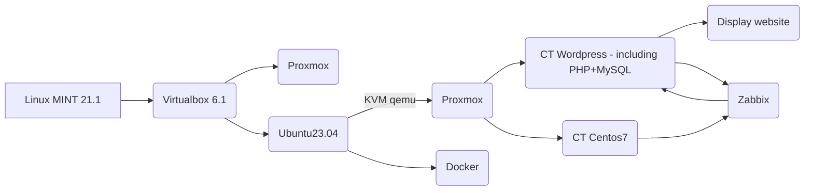

Project display website by Wordpress. Workflow shows:

Configuration on ubuntu 23.04 shows:\
`inet 10.0.2.15/24 brd 10.0.2.255 scope global dynamic noprefixroute enp3s0`

To install Proxmox on ubuntu i used qemu:\
`sudo apt update`\
`sudo apt full-upgrade`\
`sudo apt install virt-manager`\
`reboot`\
`sudo virt-manager`

In qemu i created new VM with existing proxmox iso including distro name "Debian 10".
Proxmox configuration:\
`enp1s0 interface`\
`Hostname (FQDN): devops.local`\
`IPv4: 192.168.122.63 /24`\
`GW: 192.168.122.1`\
`DNS: 192.168.122.1`\
`Filesystem: ext4`

Login to proxmox:\
`login: root`\
`password: during installation`

Went to firefox and write 192.168.122.63:8006 and hit enter. Then login with root account with a password.

I installed wordpress from here: https://mirror.umd.edu/turnkeylinux/images/proxmox/ with name:\
`debian-10-turnkey-wordpress_16.1-1_amd64.tar.gz`

I Created CT LXC container with Wordpress

Useful materials you can find here:\
`https://www.youtube.com/watch?v=nW7_jnBNIRU LAMP LXC`\
`https://www.youtube.com/watch?v=OToQ4LAHz6I WORDPRESS LXC`

Wordpress configuration:\
`net0 192.168.122.122/24, gw=192.168.122.1`\
`MySQL admin password: `\
`https://192.168.122.122/wp-login`

Zabbix configuration:\
`https://github.com/takala-jp/zabbix-proxmox`\
`https://geekistheway.com/2022/12/31/monitoring-proxmox-ve-using-zabbix-agent/`\
`https://github.com/kvaps/zabbix-linux-container-template`\
`https://beitadmin.pl/tag/zabbix/`

`https://technologyrss.com/how-to-install-zabbix-server-6-2-on-ubuntu-22-04/`

need to installed "zabbix-agent2" because ubuntu 23.04 is wihout LTS.

Current issue: Zabbix server does not work. zabbix-server-mysql : need libldap-2.5-0 (>= 2.5.4) but it is not possible to install. Recommend "snmpd" but it is not installed.

Try to install CentOS 8 stream as VM in proxmox and then zabbix server on it:\
`https://computingforgeeks.com/how-to-install-zabbix-on-rhel-centos-stream/`\
Its impossible install vm on proxmox on kvm, there is an error `kvm: warning: host doesn't support requested feature: CPUID.01H:EDX.vme [bit]1`

Install CentOS as CT lxc in proxmox:\
`https://docs.ossii.com.tw/books/oxoffice-online-technical-manual/page/installation-guide-for-centos-7-in-pve-lxc-%28community-edition%29`\
Configuration:\
`ip: 192.168.122.123/24`\
`gw: 192.168.122.1`\
`username: root`

error: "WARN: old systemd (<v232) detected, container won't run in a purge cgroupv2 enrivonment! Please see documentation -> container -> cgroup version.

In KVM proxmox edit grub file (with making backup (for example cp grub grub1):\ 
`vi /etc/default/grub and edit line to: GRUB_CMDLINE_LINUX_DEFAULT="systemd.unified_cgroup_hierarchy=0 quiet `\
then run the following command:\
`yum install vim openssh* net-tools unzip wget -y`\
`cd /etc/yum.repos.d`\
`wget --no-check-certificate http://www.oxoffice.com.tw/yum.repo/oxool-community.repo`\
`yum update -y`\
`yum groupinstall "OxOOL Community Group" -y`

Start OxOOL Community:\
`systemctl enable oxool`\
`reboot`

Reboot, login as root, and check if OxOOL Community edition starts normally:
`netstat -tlnp`

It should look like this:\
Active Internet connections (only servers)
| Proto | Recv-Q | Send-Q | Local Address | Foreign Address | State | PID/Program name |
|-------|--------|--------|---------------|-----------------|-------|------------------|
| tcp | 0 | 0 | 127.0.0.1:9981 | 0.0.0.0:* | LISTEN | 268/oxool |
| tcp | 0 | 0 | 0.0.0.0:22 | 0.0.0.0:* | LISTEN | 267/sshd |  
|tcp6 | 0 | 0 | :::9980 | :::* | LISTEN | 268/oxool |
|tcp6 | 0 | 0 | :::22 | :::* | LISTEN | 267/sshd |

Pro-tip!

When steps above are finished, you can use "More"→"Convert to template" to generate new LXC template that contains OxOOL Community edition.

Install Zabbix on CT centos7 core:\
`https://computingforgeeks.com/how-to-install-zabbix-server-on-centos-7/`\
Requirements:
Apache web server
PHP with required extensions
MariaDB server

error:\
`bash: yum-config-manager: command not found`\
need to install:\
`yum install yum-utils`
to execute yum-config-manager

Congratulations! Zabbix has been configured.
Configuration file "etc/zabbix/web/zabbix.conf.php" created.

Zabbix login address:\
`192.168.122.123/zabbix/`\
`Username: "Admin"`\
`Password: "zabbix" then change to yours password.`

Next step:

Add Applications/Items/Triggers/Grapsh in Zabbix for CT wordpress to monitor that container. Awesome!

error with Availability for word_prox:\
`Get value from agent failed: cannot connect to [[192.168.122.122]:10050]:[111] Connection refused`

Docker for wordpress:\
`https://wpart.pl/docker-dla-wordpress/`

Automation by Ansible:
--
First of all, need to install virtualenv and required packages `proxmoxer` and `requests`:
`python -m venv tutorial-env`\
`pip3 install proxmoxer --break-system-packages`\
`pip3 install virtualenv --break-system-packages`

Pro-tip!
Every project should be realized by python venv. I created venv in location:\
`~/ansible_lab/.venv/devops/bin`\
`dev@ops: ~/ansible_lab/.venv/devops/bin$ source activate`\

check a few important things:\
`pip freeze |grep -i proxmox`\
`pip freeze` checking every modules\
`which ansible`\
`which pip3`

It should be in `.venv/devops/bin` directory.

check proxmoxer path in proxmox:

[main7.yml]
- hosts: all
  vars:
    ansible_python_interpreter: "/usr/bin/python3"
    
    with command `$ ansible-playbook main7.yml` is working fine
  
Next useful list pack:\
`ansible-galaxy collection list`\
`ansible --version |grep "python version"`\
`python -m pip list`\
`python -m pip show proxmoxer`

`ansible all -m ping`

`ansible server01 -m setup -a "filter=ansible_distribution*"`\
`https://beitadmin.pl/kurs-ansible-pierwszy-playbook-cz-3/`

Created another proxmox directly in Virtualbox with ip:\
`192.168.0.37`

check proxmoxer in venv path:\
[hosts]
`- hosts: all`\
  `vars:`\
    `ansible_python_interpreter: "/home/dev/ansible_lab/.venv/devops/bin/python3"`

with command: `ansible-playbook -i hosts main7.yml -vv` is working fine.

`ansible all -m ping -vv` is checking everything

After all i found information that `proxmoxer` should be installed on `proxmox` server and on the `ubuntu 23.04` 

Installation proxmoxer on proxmox:\
`apt install python3-pip`	\
`pip3 install proxmoxer` \
`pip3 install requests` \
`python3 -m pip list` 

during this error:\
`fatal: [192.168.122.63]: FAILED! => {"changed": false, "module_stderr": "Shared connection to 192.168.122.63 closed.\r\n", "module_stdout": "/bin/sh: 1: /usr/local/lib/python3.9/dist-packages: Permission denied\r\n", "msg": "MODULE FAILURE\nSee stdout/stderr for the exact error", "rc": 126} \`

Changed my `hosts` file to:\

`[server01]`\
`#192.168.0.37 ansible_ssh_pass=xxx ansible_ssh_user=root`\
`192.168.122.63 ansible_ssh_pass=xxx ansible_ssh_user=root`\
`[server01:vars]`\
`ansible_python_interpreter=/usr/bin/python3`

Useful link:\
`https://pve.proxmox.com/wiki/Linux_Container`

Login to the proxmox server and check:\
`ssh root@192.168.122.63`
`pveam list local` \
`pvesm status` \
`nano /etc/pve/storage.cfg` \
`cd /etc/pve/local/lxc/` \
`cat 100.conf` configuration CT

to set rootfs if main6.yml add:\
`Disk: 8` which created disk with size=8G\
`https://pve.proxmox.com/pve-docs/chapter-pct.html` 

Avaiable parameters:
--
`community.general.proxmox Supported parameters include: api_host, api_password, api_token_id, api_token_secret, api_user, clone, clone_type, cores, cpus, cpuunits, description, disk, features, force, hookscript, hostname, ip_address, memory, mounts, nameserver, netif, node, onboot, ostemplate, password, pool, proxmox_default_behavior, pubkey, purge, searchdomain, state, storage, swap, tags, timeout, unprivileged, validate_certs, vmid.`

`https://docs.ansible.com/ansible/latest/collections/community/general/proxmox_module.html`

`https://forum.proxmox.com/threads/storage-local-does-not-support-container-directories-when-creating-new-containter.68317/`

`https://docs.ansible.com/ansible/latest/collections/community/general/proxmox_disk_module.html`

How it works at the moment:
--
1. Go to path:\
`cd '/home/dev/ansible_lab/.venv/devops/bin/'`
2. Execute command:\
`source activate`
3. Then:\
`ansible-playbook -i hosts main6.yml = Creat CT`\
`ansible-playbook -i hosts main61.yml = Start CT`

How to run f.e. 10 CT by one ansible yaml code?
