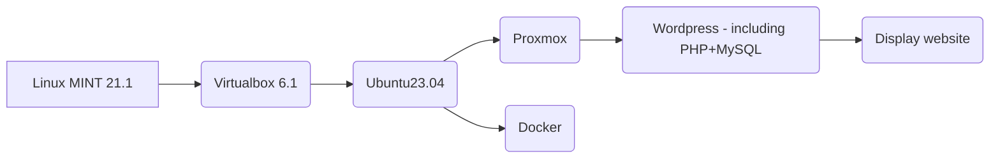

Project display website www. Workflow shows:

```mermaid
graph LR
A[Linux MINT 21.1] --> B(Virtualbox 6.1)
B --> C(Ubuntu23.04)
C --> D(Proxmox)
D --> E(Wordpress - including PHP+MySQL)
E --> G(Display website)
C --> F(Docker)
```
Configuration on ubuntu 23.04 shows:\
`inet 10.0.2.15/24 brd 10.0.2.255 scope global dynamic noprefixroute enp3s0`

