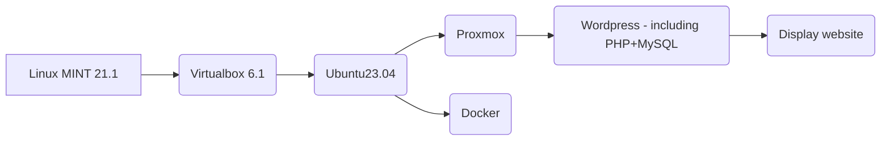

Project display website www. Workflow shows:

Configuration on ubuntu 23.04 shows:\
`inet 10.0.2.15/24 brd 10.0.2.255 scope global dynamic noprefixroute enp3s0`

To install Proxmox on ubuntu i used qemu:\
`sudo apt update`\
`sudo apt full-upgrade`\
`sudo apt install virt-manager`\
`reboot`\
`sudo virt-manager`

In qemu i created new VM with existing proxmox iso with distro name "Debian 10".
Proxmox configuration:\
`enp1s0 interface`\
`Hostname (FQDN): devops.local`\
`IPv4: 192.168.122.63 /24`\
`GW: 192.168.122.1`\
`DNS: 192.168.122.1`\
`Filesystem: ext4`

Login to proxmox:\
`login: root`\
`password: during installation`

Went to firefox and write 192.168.122.63:8006 and hit enter. Then login with root account with a password.

I installed wordpress from here: https://mirror.umd.edu/turnkeylinux/images/proxmox/ with name:\
`debian-10-turnkey-wordpress_16.1-1_amd64.tar.gz`

I Created LXC container with LAMP

Useful materials you can find here:\
`https://www.youtube.com/watch?v=nW7_jnBNIRU LAMP LXC`\
`https://www.youtube.com/watch?v=OToQ4LAHz6I WORDPRESS LXC`
