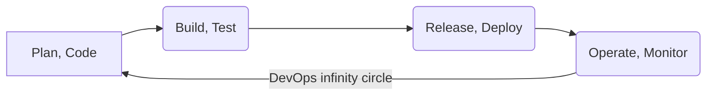

# Witam

Nazywam się Daniel. Posiadam analityczny, matematyczny umysł, który świetnie wykorzystuję do optymalizacji procesu.

>Interesuje się szeroko pojętymi wirtualizacjami:
- *Hyper-V* (głównie),
- *VirtualBox*,
- *VmWare*,
- *Proxmox*, 
- *Docker* (**new Tech IT** dzięki któremu, poszerzam swoją wiedzę o szeroko pojęte konteneryzacje).

W czasie prywatnym instaluję różne distro Linuksowe, sprawdzam konfigurację oraz możliwości dystrybucji. Interesuje mnie filozifia Ethical Hacking'u, którą można realizować za pomocą *Kali* Linuksa.

### Chciałbym jak najdokładniej poznać dockera, terraform oraz k8s + całą gamę aplikacji automatyzacyjnych, żeby być na bieżąco z nowinkami technologicznymi.

###### Pasjonuje się triathlonem. Najbardziej lubię *kolarstwo*, nie zapominam jednak o **pływaniu**, które działa kojąco po wyczerpującym treningu. W ciągu roku startuję w zorganizowanych biegach, np **Bieg ulicą Piotrkowską** w Łodzi oraz przystępuję amatorsko do zawodów triathlonowych. Sport jest dla mnie balansem pomiędzy pracą a hardeningiem w czasie wolnym. Porządkuję wtedy wiedzę. Często podczas jazdy na rowerze odkrywam informatyczną *eurekę* której czasem próżno szukac surfując w internecie.  

>Sport jest dla mnie balansem pomiędzy pracą a hardeningiem w czasie wolnym.

Poniżej gałąź IT, w której chcę się rozwijać, podejmować coraz to bardziej skomplikowane wyzwania oraz zdobywać cenne doświadczenie. 

